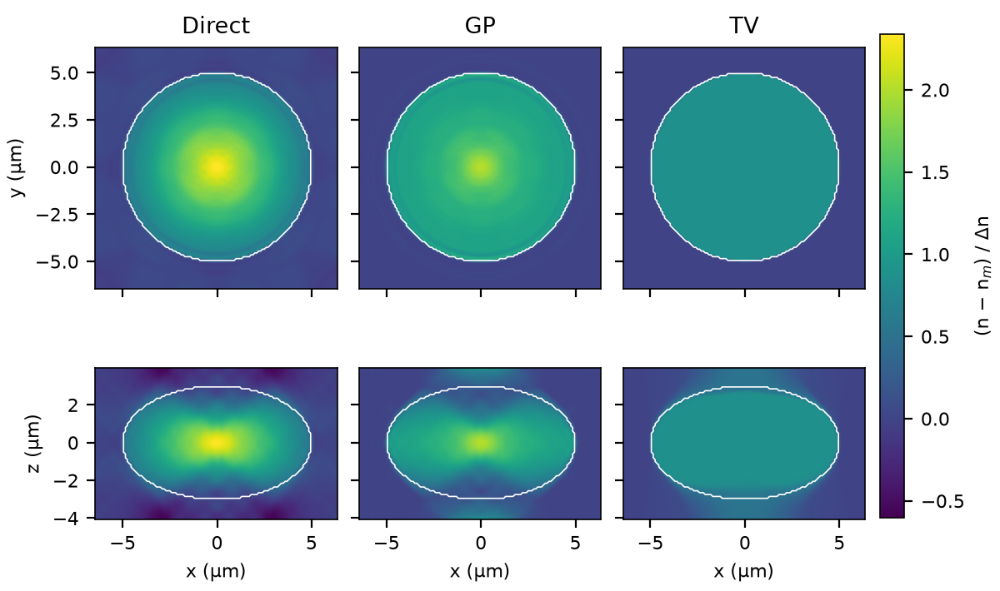

# Forward scattering and ODT reconstruction

MATLAB experiments comparing Born/Rytov approximations with a full-vector Maxwell spheroid solver, followed by direct Fourier, Gerchberg–Papoulis (GP), and total-variation (TV) reconstruction of a 3D refractive-index volume.

## Dependencies

- MATLAB R2024a; base MATLAB functions, no additional toolboxes or Java required for the commands below.
- Python 3.11, NumPy 2.4, SciPy 1.17, and Matplotlib 3.11 for checking saved results and drawing figures.
- Conda for creating the Python environment.

## Setup

```sh
git clone https://github.com/Jhnnn001/mie-scatt-algorithm.git
cd mie-scatt-algorithm
conda env create -f environment.yml
conda activate mie-odt
```

Make `matlab` available on your shell's PATH; for the macOS R2024a installation:

```sh
export PATH="/Applications/MATLAB_R2024a.app/bin:$PATH"
```

If MATLAB cannot find built-in functions such as `addpath`, restore its factory search path for this shell session:

```sh
export MATLABPATH="$(perl /Applications/MATLAB_R2024a.app/toolbox/local/getphlpaths.pl /Applications/MATLAB_R2024a.app)"
```

## Run

Check the solvers and regenerate the four figures from the included results:

```sh
matlab -nojvm -batch "run_project('check')"
python plot_results.py
```

The slower literature benchmark is available separately (about 27 minutes in the recorded original run):

```sh
matlab -nojvm -batch "addpath('spheroid-analytic-forward','spheroid-analytic-forward/tests'); test_barton2001"
```

Reproduce the experiments:

```sh
matlab -nojvm -batch "run_project('forward')"  # Prolate baseline, oblate size/contrast sweeps
matlab -nojvm -batch "run_project('fields')"   # Exact/Born/Rytov sections and the omitted Q term
matlab -nojvm -batch "run_project('inverse')"  # Direct, GP, TV, and matched-data control
python plot_results.py
```

The runs reuse validated checkpoints, regenerate missing caches, and refresh CSVs; to recalculate an inverse volume, remove only its `<run>_<method>.mat` checkpoint before running the inverse stage.
The cited volumes are `padding8_direct.mat`, `padding8_gp.mat`, and `tv_strict_tv.mat` under `inverse/results/`; `linear_control_*` contains data generated with the same discrete operator used for reconstruction.
Fresh inverse solves take minutes per method; figures are written to `results/`.

`spheroid-analytic-forward/` contains the Maxwell solver and the size (`1/`) and contrast (`2/`) experiments; `forward/` contains Born/Rytov models and field analysis; `inverse/` contains Ewald sampling, its adjoint, reconstruction, and retained volumes.

## Results

| Experiment | Relative error |
|---|---|
| Prolate baseline | Born **197.6%**, Rytov **25.7%** |
| Oblate baseline | Born **91.3%**, Rytov **10.5%** |
| Size reduced to 1/100 | Born and Rytov **0.72%**, against the scalar reference |
| Index contrast reduced to 1/100 | Born **0.88%**, Rytov **0.091%**, against the scalar reference |
| Low-contrast oblate reconstruction | Direct **46.9%**, GP **36.4%**, TV **28.9%** |

Forward errors measure the complex scattered field after the detector pupil, using Maxwell `Ex` for the prolate case and the incident-polarization projection for the oblate case; oblate errors are illumination-pupil-weighted means.
Reconstruction error is `||n_reconstructed − n_true||₂ / ||n_true − n_background||₂` over the full volume.
In the oblate interior, the omitted Rytov term `Q = ∇ψ · ∇ψ` reaches `|Q|/|f| = 14.33` near the center, consistent with concentrated internal reflections ([details](forward/exp/oblate_Q_mechanism.md)).



White contours mark the true boundary.

All cases use wavelength 0.532 μm and background index 1.335381534, with transverse polarization `pol=[1,0]` from `incident_plane_wave.m`.

| Case | Semiaxes (z, x/y), μm | Object index | Illumination / detector NA | Detector z, μm |
|---|---|---|---|---|
| Prolate | 5, 2.5 | 1.37 | 0 / 0.1 | 7 |
| Oblate | 3, 5 | 1.365 | 0.5 / 1.0 | 5 |
| Inverse | 3, 5 | 1.33567771866 | 0.5 / 1.0 | 5 |

The inverse uses 81 illuminations and a 128 × 128 × 80 volume at 0.1 μm spacing; its low-contrast Rytov forward error against Maxwell is 0.66%.
Small data residuals coexist with substantial RI error, including in the matched-data control, consistent with missing-cone ambiguity alongside numerical and regularization effects.
The reported GP run is unconverged; the study uses a single homogeneous spheroid, plane-wave illumination, an ideal pupil, and no added noise.

## References

- J. P. Barton, *Applied Optics* **40**, 3598–3607 (2001): spheroidal Maxwell scattering and far-field validation.
- S. Asano and G. Yamamoto, *Applied Optics* **14**, 29–49 (1975): spheroidal wave-function expansion.
- A. C. Kak and M. Slaney, *Principles of Computerized Tomographic Imaging*, Chapter 6 (1988): diffraction tomography.
- K. Lim et al., *Optics Express* **23**, 16933–16948 (2015): missing-cone regularization.
- T. Goldstein and S. Osher, *SIAM Journal on Imaging Sciences* **2**, 323–343 (2009): split Bregman optimization.
