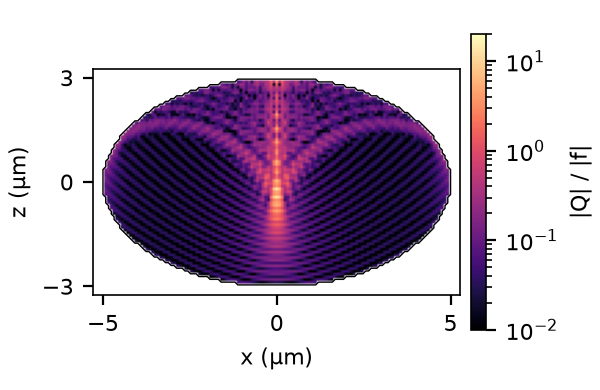

# Omitted nonlinear term in the Rytov approximation

For the scalar Helmholtz field `U = U0 exp(ψ)` and incident plane wave `U0`, the exact equation is

```text
∇²ψ + 2i k_inc · ∇ψ = −f − Q,
Q = ∇ψ · ∇ψ,    f = k0²(n² − n_background²).
```

Here `k_inc` is the incident wavevector and `k0 = 2π/λ0` is the vacuum wavenumber.
The first-order Rytov approximation drops `Q` ([derivation, Section 3.2](https://arxiv.org/pdf/1507.00466#page=12)).
Here `ψ` contains both log amplitude and phase, and `Q` uses a dot product without complex conjugation.

For the [oblate baseline](../../README.md#results) at normal incidence, the largest sampled interior value on the `y=0` slice is **|Q|/|f| = 14.33**, at **(x,z) = (0,−0.20) μm**.
This is calculated from the scalar field and its derivatives in [oblate_xz_exact.mat](oblate_xz_exact.mat), using [oblate_field_analysis.m](oblate_field_analysis.m).
The omitted term is therefore locally large, although this ratio alone does not quantify the detector-plane error.



A Hann-windowed axial spectrum over `|z| < 2.5 μm` contains a negative-`k_z` component well above the leakage from a pure forward plane wave.
This supports a backward-wave contribution; a plausible explanation for the central maximum is interference with internally reflected waves concentrated near the axis.
The one-dimensional spectrum does not isolate reflection orders or measure reflected power.
