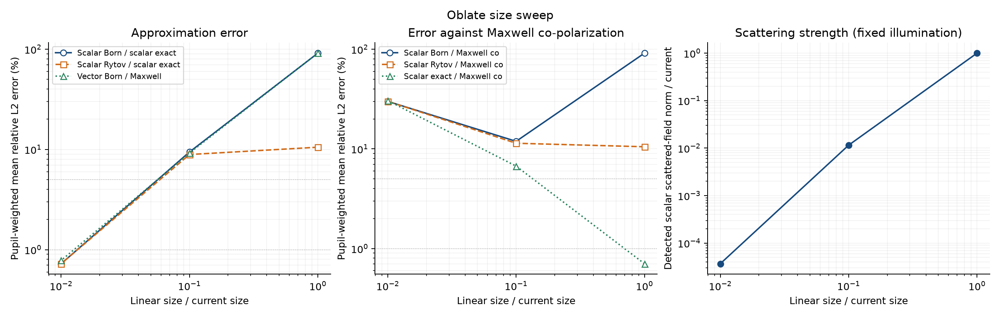
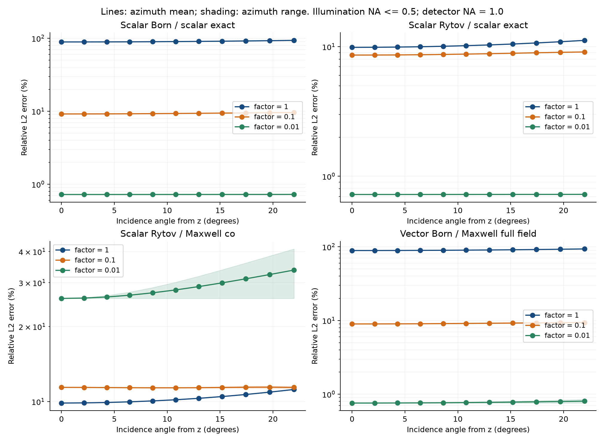

# 1. 크기에 따른 Born·Rytov 정확도

실험일: 2026-09-13. 기존 oblate spheroid의 두 반축을 같은 비율로 줄이고, 굴절률·파장·입사 및 검출 조건을 유지한 수치 실험이다. 결과는 복소 **산란장**을 기준으로 평가한다. 이전 xz 그림의 전체장 크기 오차와는 다른 지표다.

**결론: 크기를 줄이자 Born 자체의 오차는 감소했다.** Scalar Born 대 scalar exact의 평균 오차는 91.281% → 9.425% → 0.724%였고, vector Born 대 Maxwell도 91.274% → 9.215% → 0.781%로 감소했다. 반면 기존 scalar Born/Rytov를 Maxwell에 비교하면 가장 작은 물체에서 약 30%의 co-polarized 오차가 남는다. 이때는 scalar approximation이 성립하지 않는다.

## 실험 조건

| 항목 | 값 |
|---|---|
| 진공 파장 λ₀ | 0.532 μm |
| 배경 굴절률 nₘ | 1.335381534 |
| 물질 굴절률 nₚ | 1.365 |
| 굴절률 차 Δn | 0.029618466 |
| 굴절률 비 nₚ/nₘ | 1.022179778023 |
| 배경 매질 파장 λₘ = λ₀/nₘ | 약 0.398388 μm |
| 형상 | z축이 짧은 균질 oblate spheroid, a:b = 3:5 |
| 크기 인자 s | 1, 0.1, 0.01 |
| a, b의 뜻 | a: z 반축, b: x·y 반축 |
| 검출면 | 물체 중심 기준 z = 5 μm, 모든 크기에서 고정 |
| 검출 NA | 1.0 |
| 입사 NA | 0, 0.05, …, 0.50 |
| 입사 극각 | θ = arcsin(NAᵢ/nₘ), 최대 약 21.9888° |
| 방위각 | φ = 0°, 45°, …, 315°, 정상 입사는 한 번만 계산 |
| 입사 편광 | 기존 incident_plane_wave의 pol=[1,0] |
| 입사장 진폭 | 1 |

| 조건 | s | a (μm) | b (μm) | 전체 x×y×z 크기 (μm) | 중심 직선 경로 위상 지표 δ = (2π/λ₀)Δn·2a |
|---|---:|---:|---:|---|---:|
| 현재 | 1 | 3 | 5 | 10×10×6 | 2.098853 rad |
| 중간 | 0.1 | 0.3 | 0.5 | 1×1×0.6 | 0.209885 rad |
| 매우 작음 | 0.01 | 0.03 | 0.05 | 0.1×0.1×0.06 | 0.020989 rad |

여기서 중간 크기는 선형 크기의 산술 중간이 아니라, 현재와 매우 작은 크기 사이의 **로그 간격 중간**으로 선택했다. 가장 작은 물체의 가로 지름 0.1 μm는 λₘ의 약 0.251배다. 크기를 줄여도 물체를 구성하는 굴절률 비는 변하지 않는다.

## 계산 방법과 편광

형상은 (x²+y²)/b² + z²/a² ≤ 1이다. 경계를 voxel로 근사하지 않고 연속 spheroid를 사용했다. 따라서 0.1 μm detector pitch가 가장 작은 물체의 형상을 한 voxel로 표현한다는 뜻이 아니다. 이 pitch는 검출장의 FFT 격자 간격이다.

정확한 기준장은 기존 spheroidal-wave boundary solver로 계산한 scalar Helmholtz 해와 Maxwell 벡터 해다. 여기서 exact는 모드 절단과 경계 잔차를 검증한 수치 기준해를 뜻한다. Scalar exact와 Maxwell exact는 서로 다른 방정식의 해다.

기존 [oblate_na_sweep.m](../../forward/exp/oblate_na_sweep.m)에 `helpers` 출력만 추가하여 같은 batch reference, far-field 및 Born/Rytov 함수를 재사용했다. 두 실험의 공통 실행 코드는 [parameter_sweep.m](parameter_sweep.m)이며, 이전 forward/voxel 구현 자체를 교체하지 않았다.

편광 정의는 다음과 같다.

```text
k̂ᵢ = (sinθ cosφ, sinθ sinφ, cosθ)
e_TE = (−sinφ, cosφ, 0)
e_TM = (cosθ cosφ, cosθ sinφ, −sinθ)
e₀ = cosφ e_TM − sinφ e_TE
```

φ=0°에서는 e₀=(cosθ,0,−sinθ), φ=90°에서는 e₀=(1,0,0)이다. 방위각 전체에서 항상 순수 TM인 정의는 아니다. TM·TE 기준해를 조합하고 좌표 회전을 검증하여 원래 편광을 복원했다.

연속 형상의 scalar Born detector spectrum은 다음 식을 사용한다.

```text
k₀ = 2π/λ₀,  kₘ = k₀nₘ
f₀ = k₀²(nₚ²−nₘ²),  V = 4πab²/3
k_z = √(kₘ²−k_x²−k_y²)
q² = b²[(k_x−kᵢₓ)²+(k_y−kᵢᵧ)²] + a²(k_z−kᵢ_z)²
F(q) = 3(sin q−q cos q)/q³,  F(0)=1
B(k_x,k_y) = i f₀ V F(q) exp(i k_z z_det)/(2k_z)
u_B = inverse-FFT[B],  ψ₁ = u_B/u₀
u_R = u₀[exp(ψ₁)−1]
R = FFT[u_R]
P = 1 when k_x²+k_y² ≤ (k₀ NA_det)², otherwise 0
```

B와 R은 산란장이다. 전체장이 필요하면 u₀를 더해야 한다. Rytov에서는 먼저 모든 forward-propagating spectrum으로 ψ₁와 지수함수를 계산하고, **마지막에** detector pupil P를 적용했다. P를 먼저 적용한 Born으로 Rytov를 만들지 않았다. Evanescent 성분은 기존 detector forward 실험과 동일하게 제외했다.

Maxwell에 대한 scalar model 오차를 분리하기 위해 다음 vector Born도 대조군으로 계산했다.

```text
ŝ = (k_x,k_y,k_z)/kₘ
E_B,vector = B[e₀−ŝ(ŝ·e₀)]
```

이 투영은 산란파의 횡방향 조건 ŝ·E=0을 반영한 1차 Maxwell Born이다. Scalar Rytov를 vector Rytov로 바꾼 것은 아니다.

## 오차와 평균의 정의

각 입사 방향에서 ε = ‖P(A−A_exact)‖₂ / ‖P A_exact‖₂로 계산했다. 복소 진폭과 위상 모두 포함하며, 보고서의 백분율은 CSV의 상대 오차에 100을 곱한 값이다.

| CSV metric | 비교 |
|---|---|
| born_scalar, rytov_scalar | Scalar Born/Rytov 대 scalar exact: scalar 근사 차수의 오차 |
| born_co, rytov_co | Scalar Born/Rytov 대 Maxwell co-polarized 산란장 e₀·E_exact |
| born_full, rytov_full | e₀를 곱한 scalar Born/Rytov 대 Maxwell 3성분 전체 |
| scalar_co, scalar_full | Scalar exact 대 Maxwell: scalar model 자체의 오차 |
| vector_born_co, vector_born_full | 횡방향 투영을 포함한 Maxwell Born 대 Maxwell exact |

주요 평균은 81개 방향의 단순 산술평균이 아니라 **입사 pupil 면적에 대해 균일한 평균**이다. NA의 인접 표본 중간값을 annulus 경계로 잡고, 각 annulus 면적을 해당 방위각 수로 나눈 가중치 wⱼ를 사용한다. Σwⱼ=1이며, 평균은 Σεⱼwⱼ다. 각 ring 안의 방위각 가중치는 동일하다.

`pooled_L2`는 √[Σwⱼ‖Aⱼ−A_exact,ⱼ‖₂² / Σwⱼ‖A_exact,ⱼ‖₂²]이고, 위의 평균과 별개다. `maximum`은 계산한 81개 방향 중 최대값이다. 1%와 5%는 이 실험의 판정 기준으로 제시한 값이며, 사용자가 지정한 정확도 보장은 아니다. `fraction_below_*` 역시 단순 방향 개수가 아니라 pupil 가중치 합이다.

## 계산 결과

### 같은 물리 모델 안에서의 Born·Rytov 오차

모든 숫자는 상대 오차의 %다. 괄호는 계산한 81개 방향의 최소–최대다.

| 조건 | Scalar Born 대 scalar exact | Scalar Rytov 대 scalar exact | Vector Born 대 Maxwell 전체 |
|---|---:|---:|---:|
| 현재, s=1 | 91.2813 (89.0471–93.6109) | 10.5254 (9.8902–11.1987) | 91.2736 (89.0398–93.6033) |
| 중간, s=0.1 | 9.4253 (9.1838–9.6033) | 8.8985 (8.6230–9.1132) | 9.2151 (8.9778–9.3993) |
| 매우 작음, s=0.01 | 0.7244 (0.7235–0.7254) | 0.7244 (0.7234–0.7253) | 0.7815 (0.7583–0.8504) |

현재와 중간 크기는 세 지표 모두에서 계산한 모든 방향의 오차가 5%를 초과했다. 매우 작은 크기는 세 지표 모두에서 모든 방향의 오차가 1% 미만이었다. 따라서 이번 파라미터에서는 1/10 축소만으로 5% Born 정확도를 얻지 못했고, 1/100 축소에서는 1% 수준을 만족했다. 세 표본 사이의 정확한 전환 크기는 계산하지 않았다.

가장 작은 물체에서 scalar Born과 Rytov 평균의 차이는 약 0.0000384 percentage point에 불과하다. 검출면에서 ψ₁가 작아지면 exp(ψ₁)−1≈ψ₁이므로 두 계산이 거의 같아진다. 이 마지막 자릿수 차이를 Rytov가 유의미하게 더 우수하다는 결과로 해석하지 않는다.

### 기존 scalar forward를 Maxwell 기준으로 볼 때

| 입사 pupil 가중 평균 오차 (%) | 현재 | 중간 | 매우 작음 |
|---|---:|---:|---:|
| Scalar Born 대 Maxwell co | 91.3190 | 11.9127 | 29.9909 |
| Scalar Rytov 대 Maxwell co | 10.5093 | 11.3965 | 29.9908 |
| Scalar Born 대 Maxwell 전체 | 91.3274 | 21.5607 | 46.2274 |
| Scalar Rytov 대 Maxwell 전체 | 10.9350 | 21.2891 | 46.2274 |
| Scalar exact 대 Maxwell co | 0.7050 | 6.7194 | 30.5249 |
| Scalar exact 대 Maxwell 전체 | 3.1171 | 19.2690 | 46.5272 |

작은 구조에서 scalar forward의 Maxwell 기준 오차가 커질 수 있다는 관찰은 맞지만, 이를 Born 차수의 실패라고 부르면 원인을 잘못 구분하게 된다. 매우 작은 물체에서 vector Born은 0.7815%인데 scalar exact부터 Maxwell co에 대해 30.5249% 차이가 난다. 크기가 작아져 산란 각도 분포가 넓어졌을 때, scalar 모델이 생략한 벡터 방향성이 지배적인 오차가 된다는 해석을 이 대조군이 뒷받침한다.

매우 작은 물체의 scalar Rytov 대 Maxwell co 오차는 방향에 따라 25.9483–40.9967%였다. 이전 큰 물체의 거의 방위각 독립적인 결과를 이 크기에 그대로 적용할 수 없다. 현재 pol=[1,0] 정의에서는 입사 방향에 따라 TM·TE 혼합이 달라지기 때문이다.

`pooled_L2`도 같은 결론을 준다. Scalar Born은 91.3302%, 9.4302%, 0.7244%, scalar Rytov는 10.5436%, 8.9049%, 0.7244%다. 가장 작은 scalar Rytov의 Maxwell co pooled L2는 30.1292%다.

### 산란 신호 크기

| 조건 | 입사 방향에 대해 pooled한 scalar exact 산란장 norm / 현재 |
|---|---:|
| 현재 | 1 |
| 중간 | 0.0115466 |
| 매우 작음 | 0.0000368092 |

이는 √[Σwⱼ‖u_s,exact,ⱼ‖₂²]를 현재 값으로 나눈 것이다. 산란장은 크게 약해졌지만 기준 norm으로 나눈 상대 오차는 별도로 계산되었다. Noise를 추가하지 않았으므로 가장 작은 신호에 대한 실험 장비의 SNR이나 검출 가능성을 검증한 것은 아니다.





그림의 선은 계산한 세 크기 또는 각도 표본을 연결한 안내선이며, 중간 크기를 추가 계산하거나 연속 구간의 정확도를 보장한 곡선은 아니다.

## 해석 시 구분할 점

Born은 물체 내부의 장을 입사장으로 대체하는 근사이므로, 검출면에서 산란 신호가 약하다는 사실만으로 정확도가 보장되지 않는다. 같은 굴절률·파장·종횡비에서 크기를 줄이면 누적 위상 지표 δ도 줄어든다. 그러나 δ 하나가 모든 모양과 검출 조건에서 1% 또는 5% 오차의 보편적 임계값을 정하지는 않는다. 이 관계의 이론적 배경은 [Müller et al., §3.1](https://arxiv.org/pdf/1507.00466)에 정리되어 있다.

작은 물체는 더 넓은 각도로 산란할 수 있으므로 scalar exact와 Maxwell 사이의 차이가 커질 수 있다. Scalar Born의 차수 오차가 줄었는지와 scalar Born을 Maxwell에 비교한 오차가 줄었는지는 별도로 확인해야 한다. Vector Born 대조군은 이 차이를 판별하기 위한 것이다.

검출면 z=5 μm를 고정했으므로 z/a는 크기 감소와 함께 커진다. 따라서 이번 Rytov 결과는 각 물체의 표면에서 같은 상대 거리에 놓인 검출면 실험이 아니라, 동일한 실험실 검출면에서의 결과다. 세 크기만 계산했으므로 미계산 크기에서 오차가 단조라는 주장이나 정확한 경계 크기를 제시하지 않는다.

## 수치 검증

### Exact 기준해

| 조건 | 높은 (L,M) / 낮은 (L,M) | Maxwell cutoff 차이 | Scalar cutoff 차이 | Maxwell 경계 잔차 | Scalar 경계 잔차 |
|---|---|---:|---:|---:|---:|
| 현재 | (114,59) / (109,55) | 6.5273e−13 | 6.7524e−13 | 4.6597e−12 | 1.9486e−12 |
| 중간 | (36,18) / (31,14) | 1.4052e−10 | 1.9867e−14 | 1.6600e−11 | 1.1841e−14 |
| 매우 작음 | (40,14) / (35,10) | 7.6553e−10 | 2.4760e−13 | 2.8528e−10 | 1.1814e−15 |

위 값은 백분율이 아닌 무차원 상대값이다. 모드 비교는 NA_det≤1 안의 48개 Gauss radial nodes×64개 방위각에서 모든 입사 극각과 TM·TE를 포함하여 수행했다. 경계 잔차는 solver assembly와 다른 meridian nodes에서 검사했다. Public `spheroid_eval`과 far-field evaluator의 비교 차이는 현재·중간·매우 작음에서 각각 4.1261e−8, 9.0600e−10, 1.7431e−10이었다.

초기에 매우 작은 물체의 (L,M)=(20,10)을 사용했으나 Maxwell 경계 잔차 6.41e−5로 실패했다. [cutoff 진단](small_cutoff_diagnostic.log)에서 M=10을 유지하고 L=25,30,35,40을 시험하여 잔차가 각각 2.18e−6, 9.73e−7, 5.84e−9, 2.85e−10이 되는 것을 확인했다. 최종 계산은 (40,14), 검증은 (35,10)을 사용했다. 실패한 기준해로 산란장 오차를 보고하지 않았으며, solver 식이나 허용오차를 완화하지 않았다.

### Detector와 각도 격자

주 계산은 N=512, dx=0.1 μm, window=51.2 μm다. 각 조건에서 정상 입사와 (NAᵢ,φ)=(0.25 또는 0.5, 0°·45°·90°), 총 7방향에 대해 다음을 검사했다.

- 같은 window에서 N=1024, dx=0.05 μm로 sampling을 세분화.
- 같은 dx에서 N=1024, window=102.4 μm로 window를 두 배 확대.
- 물리적으로 같은 detector frequency의 Rytov spectrum을 직접 비교.
- 새 frequency quadrature에서 exact 대비 오차도 다시 계산.

| 조건 | Sampling 세분화: spectrum 상대차 (%) | Window 확대: spectrum 상대차 (%) | Scalar Rytov 오차 변화 (pp) | Maxwell co Rytov 오차 변화 (pp) |
|---|---:|---:|---:|---:|
| 현재 | 0.0001001 | 0.033663 | 0.0003980 | 0.0004150 |
| 중간 | 0.0001271 | 0.028198 | 0.0006657 | 0.0019516 |
| 매우 작음 | 0.0000423 | 0.003626 | 0.0000302 | 0.0068114 |

각 값은 7방향 중 최대이며, 마지막 두 열은 window 확대에 따른 변화다. pp는 percentage point다. Scalar/Maxwell 오차는 기준장의 detector quadrature도 바뀌기 때문에 spectrum 자체의 변화와 같은 양이 아니다.

입사 NA 간격을 0.05에서 0.1로, 방위각 간격을 45°에서 90°로 coarsening했을 때 모든 지표 중 평균 변화의 최대는 각각 0.0520 pp, 0.1023 pp였다. 이 최대는 작은 구조의 큰 scalar-model 오차에서 발생하며, 해당 평균의 마지막 소수 자릿수를 연속 각도 적분의 보증 정확도로 해석하지 않는다. 각 지표의 변화량은 summary.csv에 그대로 저장했다.

실행 시 weak-contrast Born/Maxwell limit 및 원래 polarization 회전 검사가 통과했다. Python으로 243개 방향의 가중 평균·pooled L2·최소/최대·1%/5% 비율을 CSV에서 독립 재계산했고 30개 요약행 모두 일치했다. 두 폴더의 현재 조건은 서로 일치했으며 이전 `forward/exp/oblate_window_51.csv`의 Born/Rytov 수치도 재현했다. 검증 기록은 [artifact_validation.log](artifact_validation.log)에 있다.

[run.log](run.log)는 앞선 검증된 두 조건을 재사용하고 마지막 조건을 완료하여 `PARAMETER_EXPERIMENT_PASS`로 종료했다. 이는 이번 실험의 실행 검증이며 저장소 전체 테스트를 새로 실행했다는 뜻은 아니다.

## 파일과 재현

- [parameters.csv](parameters.csv): 실제 사용한 물리 파라미터, 크기·위상·부피·모드 수.
- [angles.csv](angles.csv): 3조건×81방향=243행의 모든 오차 및 기준 산란장 norm.
- [summary.csv](summary.csv): 3조건×10지표=30행의 평균·pooled L2·최대·판정·각도 coarsening.
- `case_1_reference.mat`, `case_2_reference.mat`, `case_3_reference.mat`: 재사용 가능한 compact exact 계수. Dense outgoing ODE trajectory는 저장하지 않았다.
- [reference_validation.csv](reference_validation.csv): 모드 수렴, 독립 경계 잔차, public evaluator 비교.
- `case_*_detector_convergence.csv`: 각 조건의 7개 대표 방향에 대한 detector window·sampling 검증.
- [error_vs_parameter.png](error_vs_parameter.png), [PDF](error_vs_parameter.pdf): 크기별 오차와 검출 산란 신호의 상대 norm.
- [error_vs_angle.png](error_vs_angle.png), [PDF](error_vs_angle.pdf): 극각별 오차. 선은 방위각 평균, 음영은 방위각 최소–최대.
- [run.log](run.log): 실제 MATLAB 실행 및 assertion 결과.
- [plan.md](plan.md): 실험 계획과 완료 확인.

저장소 최상위에서 실행한다.

```matlab
restoredefaultpath
addpath('spheroid-analytic-forward/1')
run_size_experiment
```

MATLAB R2024a의 `-nojvm -nodesktop -nosplash` 모드로 실행했다. 각 실행에서 `restoredefaultpath` 후 필요한 프로젝트 경로만 추가했다. 이는 세션 내 path 복원이며 전역 설정 변경이 아니다.

그림 생성 및 CSV 독립 검증은 두 실험 완료 후 다음과 같이 실행한다.

```sh
/tmp/mie-oblate-plot-env/bin/python spheroid-analytic-forward/1/plot_and_validate.py
```

이 경로는 이번 세션에서 이미 존재하던 NumPy·Matplotlib 환경이다. 다른 환경에서는 해당 패키지가 있는 Python으로 같은 스크립트를 실행하면 된다. CSV와 reference 파일이 있으면 계산을 재사용한다. 모든 계산을 새로 반복하려면 기존 결과를 별도로 보관한 빈 결과 폴더에서 `parameter_sweep('size',out)`을 호출하되, out은 저장소의 `spheroid-analytic-forward` 바로 아래 폴더여야 한다.
