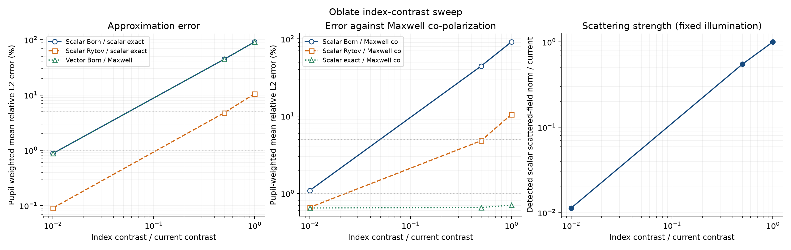
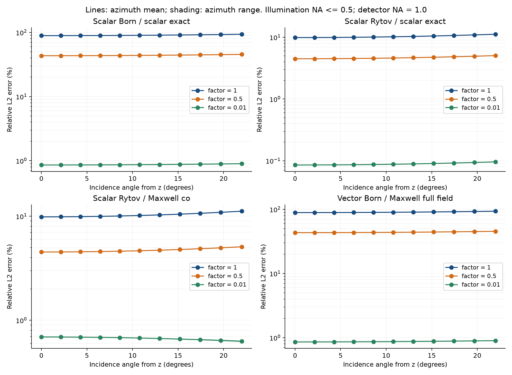

# 2. 굴절률 차 감소에 따른 Rytov 정확도

실험일: 2026-09-13. 현재 oblate spheroid의 크기를 유지하고 물질 굴절률을 배경에 가깝게 낮추어, 1차 Rytov의 복소 산란장 오차가 실제로 감소하는지 검증했다. [크기 실험](../1/readme.md)과 결과 폴더를 분리하고 동일한 solver와 오차 정의를 사용했다.

**결론: Δn 감소는 이 형상의 Rytov 오차를 크게 줄였다.** Δn을 현재의 1, 0.5, 0.01배로 바꾸면 scalar exact 기준 평균은 10.5254% → 4.7601% → 0.09054%, Maxwell co 기준 평균은 10.5093% → 4.8017% → 0.65871%였다. 거의 index-matched 조건에서는 계산한 81개 방향 모두 Maxwell co 오차가 1% 미만이었다.

## 실험 조건

| 항목 | 값 |
|---|---|
| 진공 파장 λ₀ | 0.532 μm |
| 배경 굴절률 nₘ | 1.335381534 |
| 반축 | a=3 μm: z축, b=5 μm: x·y축 |
| 전체 x×y×z 크기 | 10×10×6 μm |
| 형상 | 균질 oblate spheroid, (x²+y²)/b²+z²/a²≤1 |
| 검출면·검출 NA | z=5 μm, NA=1.0 |
| 입사 NA | 0, 0.05, …, 0.50 |
| 방위각 | 0°, 45°, …, 315°, 정상 입사는 중복 제외 |
| 입사 방향 수 | 조건당 81개 |
| 편광 | 기존 incident_plane_wave의 pol=[1,0] |

이번 인자 t는 다음과 같이 **Δn 자체를** 줄인다.

```text
Δn_current = 1.365−1.335381534 = 0.029618466
Δn(t) = t Δn_current
nₚ(t) = nₘ + t Δn_current
t = 1, 0.5, 0.01
```

| 조건 | t | nₚ | Δn | nₚ/nₘ | 중심 직선 경로 위상 지표 δ |
|---|---:|---:|---:|---:|---:|
| 현재 | 1 | 1.365000000000 | 0.029618466000 | 1.022179778023 | 2.098853 rad |
| 중간 | 0.5 | 1.350190767000 | 0.014809233000 | 1.011089889011 | 1.049427 rad |
| 거의 index-matched | 0.01 | 1.335677718660 | 0.000296184660 | 1.000221797780 | 0.020989 rad |

가장 작은 대비에서도 nₚ/nₘ는 정확히 1이 아니다. 이전 `oblate_rytov_cause.csv`의 인자는 nₚ²−nₘ²를 선형으로 줄였지만, **이번 실험은 Δn을 선형으로 줄인다.** 따라서 같은 0.5라는 숫자라도 이전 potential-scaled 실험과 물질 굴절률이 조금 다르다.

## 계산과 오차 정의

새 vector/scalar exact 기준해를 각 굴절률에서 계산하고 모드 수렴과 경계 잔차를 검사했다. 현재 조건은 검증된 기존 exact 계수를 재사용하고 detector 계산을 다시 수행했다. Exact는 수렴 검증된 수치 해이며, scalar exact는 Maxwell exact와 구분한다.

Born/Rytov의 형상 Fourier transform, FFT normalization, 검출 pupil 적용 순서, 편광 회전은 [실험 1의 방법](../1/readme.md)과 동일하다. 특히 Rytov는 detector pupil을 적용하기 전에 전체 forward-propagating Born spectrum으로 계산한다.

```text
k₀ = 2π/λ₀,  kₘ = k₀nₘ
f₀(t) = k₀²[nₚ(t)²−nₘ²]
ψ₁ = u_B/u₀
u_R = u₀[exp(ψ₁)−1]
R_detected = P·FFT[u_R]
```

u_B와 u_R는 산란장이고, P는 NA=1.0 detector pupil이다. 이번 구현은 기존 실험과 동일하게 evanescent spectrum을 포함하지 않는다. 형상은 연속 spheroid이며 voxel discretization error는 추가하지 않았다.

각 방향에서 ε = ‖P(A−A_exact)‖₂/‖P A_exact‖₂로 복소 산란장 전체를 비교했다. 본문의 평균은 81개 방향에 대해 **입사 pupil 면적에 균일한 가중치**를 적용한 Σεⱼwⱼ다. `pooled_L2`는 오차 제곱 norm들을 합친 후 나눈 값이며 별도로 저장했다. 최대값은 계산한 방향들 중 최대값이다.

| 주요 CSV metric | 의미 |
|---|---|
| rytov_scalar | 1차 scalar Rytov 대 scalar exact: Rytov 차수의 오차 |
| rytov_co | Scalar Rytov 대 Maxwell co-polarized field |
| rytov_full | e₀u_R 대 Maxwell 전체 3성분 |
| scalar_co, scalar_full | Scalar exact 대 Maxwell: scalar model의 오차 |
| born_scalar, born_co, born_full | 동일한 기준의 scalar Born 대조군 |
| vector_born_co, vector_born_full | 횡방향 투영을 포함한 Maxwell Born 대조군 |

1%와 5% 오차 기준을 함께 표시했다. 이는 이 실험에서 결과를 구분하기 위한 기준이며 사용자가 지정한 요구 정확도는 아니다. 산란장이 약해졌다는 사실과 상대 오차가 줄었다는 사실을 혼동하지 않도록 기준 산란장 norm도 함께 저장했다. 전체장 크기에 대한 이전의 약 5% 결과를 이 표와 직접 비교하면 안 된다.

## 계산 결과

### Rytov 정확도

| 조건 | Scalar exact 기준 평균 (%) | Scalar exact 기준 최대 (%) | Maxwell co 기준 평균 (%) | Maxwell co 기준 최대 (%) | Maxwell 전체 기준 평균 (%) |
|---|---:|---:|---:|---:|---:|
| 현재, t=1 | 10.5254 | 11.1987 | 10.5093 | 11.1917 | 10.9350 |
| 중간, t=0.5 | 4.7601 | 5.0496 | 4.8017 | 5.0921 | 5.5335 |
| 거의 index-matched, t=0.01 | 0.09054 | 0.09600 | 0.65871 | 0.69052 | 2.73612 |

중간 조건은 scalar exact와 Maxwell co 기준 모두 평균 5% 미만이지만, **모든 방향에서 5% 미만은 아니다.** 가장 큰 입사 NA=0.5 ring은 약 5.05–5.09%다. 이 두 지표에서 오차가 5% 미만인 방향들의 pupil 가중치 합은 90.25%였다. Maxwell 전체 3성분 기준에서는 중간 조건의 모든 계산 방향이 5%를 초과했다.

거의 index-matched 조건의 scalar Rytov 오차 범위는 0.08537–0.09600%, Maxwell co 오차 범위는 0.61821–0.69052%였다. 따라서 **scalar exact 또는 Maxwell co 기준의 1% 목표는 모든 계산 방향에서 충족**했다. Maxwell 전체 기준은 2.68089–2.77006%이므로 5%는 충족하지만 1%는 충족하지 못했다.

Pooled L2에서도 scalar Rytov는 10.5436%, 4.7687%, 0.09070%, Maxwell co Rytov는 10.5277%, 4.8102%, 0.65831%로 같은 경향이다.

### 남는 오차와 Born 대조군

| 입사 pupil 가중 평균 오차 (%) | 현재 | 중간 | 거의 index-matched |
|---|---:|---:|---:|
| Scalar exact 대 Maxwell co | 0.7050 | 0.6565 | 0.64766 |
| Scalar exact 대 Maxwell 전체 | 3.1171 | 2.8292 | 2.73349 |
| Scalar Born 대 scalar exact | 91.2813 | 44.3720 | 0.87781 |
| Scalar Born 대 Maxwell co | 91.3190 | 44.3904 | 1.09129 |
| Scalar Born 대 Maxwell 전체 | 91.3274 | 44.4589 | 2.87099 |
| Vector Born 대 Maxwell 전체 | 91.2736 | 44.3685 | 0.87774 |

거의 index-matched 조건에서 Rytov 대 Maxwell co의 0.65871%는 scalar exact 대 Maxwell co의 0.64766%와 가깝다. Maxwell 전체에서도 2.73612%와 2.73349%가 가깝다. 따라서 이 조건에서는 Rytov 차수의 오차보다 scalar-model 차이가 주된 잔여 오차임을 대조군이 보여준다. 이 오차들은 복소 벡터 norm이므로 각 백분율을 단순히 더하거나 빼서 정확한 오차 분해로 해석하지 않는다.

Scalar exact 기준에서 Δn을 100배 줄이면 Rytov 평균 오차는 약 116배 감소했다. 그러나 Maxwell co 오차는 약 16배 감소에 그쳤다. Scalar model 차이를 유지한 채 Δn만 더 줄여 모든 Maxwell 성분에서 임의로 작은 상대 오차를 얻을 수 있다고 결론 내릴 수 없다.

### 산란 신호 크기

| 조건 | 입사 방향에 대해 pooled한 scalar exact 산란장 norm / 현재 |
|---|---:|
| 현재 | 1 |
| 중간 | 0.550284 |
| 거의 index-matched | 0.0113433 |

이는 √[Σwⱼ‖u_s,exact,ⱼ‖₂²]를 현재 값으로 나눈 값이다. 분모가 작은 조건에서도 exact cutoff 검증을 상대 산란장 norm에 대해 수행했다. Noise나 실험 장비의 dynamic range는 포함하지 않았다.





세 대비를 잇는 선은 표본 사이의 시각적 안내이며, 미계산 대비의 오차를 검증한 보간 모델은 아니다.

### 크기 감소와의 비교

실험 1의 가장 작은 물체와 이번 거의 index-matched 물체는 δ≈0.020989 rad로 중심 직선 경로 위상 지표가 같다. 그러나 scalar Rytov 평균은 각각 0.7244%와 0.09054%이며, Maxwell co 기준은 각각 29.9908%와 0.65871%다. 같은 δ라도 물체 크기와 산란 각도 분포가 다르므로 Rytov 및 scalar-model 오차가 같아지지 않는다. 현재 큰 형상에서 넓은 NA를 유지하며 기존 scalar Rytov를 정확하게 쓰려는 목적에는, 이번 두 비교 중 **형상을 유지하고 Δn을 낮추는 조건**이 더 적합했다.

## Δn을 줄이는 이유와 해석 범위

로그장을 ψ=ln(u/u₀)로 정의하면 scalar Helmholtz 방정식은 다음과 같다.

```text
∇²ψ + 2i kᵢ·∇ψ + Q = −f
Q = ∇ψ·∇ψ = (∂ψ/∂x)² + (∂ψ/∂y)² + (∂ψ/∂z)²
```

Q에는 복소켤레가 없다. 1차 Rytov는 이 Q를 생략한다. 물체 내부에서 사용하는 국소적 약한 조건은 ∣Q∣≪∣f∣이며, 이것만으로 detector 오차의 전역 상한이 정해지는 것은 아니다. Rytov 전개와 생략항의 배경은 [Müller et al., §3.2](https://arxiv.org/pdf/1507.00466)에 있다.

고정된 형상에서 약한 대비의 규칙적인 섭동 전개가 가능하면 ψ는 Δn의 1차, Q는 Δn의 2차, f는 Δn의 1차부터 시작한다. 따라서 Δn→0에서 ∣Q∣/∣f∣가 작아지는 방향을 예상할 수 있다. 이번 실험은 그 기대를 실제 detector 오차로 검증한 것이며, 새로운 내부 Q 지도나 반사 차수 분해를 계산한 것은 아니다.

Scalar approximation과 Rytov approximation은 별개다. Δn을 줄여도 벡터 산란의 방향별 횡방향 투영을 scalar 모델이 자동으로 복원하지는 않는다. 따라서 `rytov_scalar`가 매우 작아지는 동시에 `rytov_co` 또는 `rytov_full`에 scalar model 차이가 남을 수 있다. 해당 잔여 오차는 `scalar_co`, `scalar_full` 대조군으로 판단한다.

이 세 대비의 결과로 모든 물체와 NA에 공통인 Δn 임계값을 정하지 않는다. 흡수·형상 변경·검출 거리 변경·2차 Rytov·inverse reconstruction은 이번 실험 범위에 포함하지 않았다.

## 수치 검증

### Exact 기준해

세 대비 모두 높은 (L,M)=(114,59), 낮은 (109,55)를 비교했다. 다음 값은 %가 아닌 무차원 상대값이다.

| 조건 | Maxwell cutoff 차이 | Scalar cutoff 차이 | Maxwell 경계 잔차 | Scalar 경계 잔차 | Public far-field 비교 |
|---|---:|---:|---:|---:|---:|
| 현재 | 6.5273e−13 | 6.7524e−13 | 4.6597e−12 | 1.9486e−12 | 4.1261e−8 |
| 중간 | 9.0315e−13 | 1.0394e−12 | 3.7573e−12 | 2.0728e−12 | 4.2631e−8 |
| 거의 index-matched | 4.6796e−11 | 5.0444e−11 | 3.8164e−12 | 1.8056e−12 | 4.3166e−8 |

모드 비교는 detector NA≤1의 48개 Gauss radial nodes×64개 방위각에서 모든 입사 극각·TM·TE를 포함했다. 독립 경계 잔차, public `spheroid_eval`과 analytic far limit의 비교, weak-contrast Born 대조군 및 원래 편광 정의에 대한 검사가 통과했다.

### Detector와 각도 격자

주 계산은 N=512, dx=0.1 μm, window=51.2 μm다. 각 조건에서 7개 대표 방향, 즉 정상 입사와 (NAᵢ,φ)=(0.25 또는 0.5, 0°·45°·90°)를 사용하여 같은 window의 dx=0.05 μm 및 같은 dx의 window=102.4 μm를 비교했다.

| 조건 | Sampling 세분화: spectrum 상대차 (%) | Window 확대: spectrum 상대차 (%) | Scalar Rytov 오차 변화 (pp) | Maxwell co Rytov 오차 변화 (pp) |
|---|---:|---:|---:|---:|
| 현재 | 0.0001001 | 0.033663 | 0.0003980 | 0.0004150 |
| 중간 | 0.0000456 | 0.014309 | 0.0001966 | 0.0002205 |
| 거의 index-matched | 0.000000890 | 0.0002655 | 0.00000362 | 0.0002315 |

각 값은 대표 방향 중 최대이고, 마지막 두 열은 window 확대 시의 오차 변화다. pp는 percentage point다. 거의 index-matched 조건의 0.09% scalar Rytov 오차는 검증에서 관찰한 detector 수치 변화보다 충분히 크며, 수치 noise만으로 생긴 결과가 아니다.

입사 NA 간격을 0.1로 coarsening했을 때 모든 지표 중 평균 변화의 최대는 0.0380 pp였다. 방위각 간격을 90°로 바꾼 경우 최대 0.0000862 pp였다. Rytov scalar/co만 보면 NA coarsening 최대는 약 0.0110 pp다. 이 검사는 유한 각도 표본의 안정성을 보여주며, 연속 각도 전체의 엄밀한 오차 상한을 뜻하지 않는다.

Python에서 243개 방향의 평균·pooled L2·최소/최대·1%/5% 가중 비율을 독립 재계산하여 30개 요약행과 일치함을 확인했다. 두 프로젝트의 현재 조건은 같았고 이전 `oblate_window_51.csv`의 결과도 재현했다. 검증 기록은 공통 [artifact_validation.log](../1/artifact_validation.log)에 있다.

[run.log](run.log)는 세 조건을 완료하고 `PARAMETER_EXPERIMENT_PASS`로 종료했다. 이번 데이터와 실험 assertion을 검증했으며 저장소 전체 테스트·inverse 계산을 새로 검증한 것은 아니다.

## 파일과 재현

- [parameters.csv](parameters.csv): 실제 nₚ, Δn, nₚ/nₘ, 위상 지표 및 공통 파라미터.
- [angles.csv](angles.csv): 3조건×81방향=243행.
- [summary.csv](summary.csv): 3조건×10오차 지표=30행.
- `case_*_reference.mat`: 굴절률별 compact exact 계수. Dense outgoing ODE trajectory는 생략했다.
- [reference_validation.csv](reference_validation.csv): scalar/vector 모드 수렴, 경계 잔차, public evaluator 비교.
- `case_*_detector_convergence.csv`: 조건당 7개 대표 방향의 detector 검증.
- [error_vs_parameter.png](error_vs_parameter.png), [PDF](error_vs_parameter.pdf): 대비별 오차 및 상대 산란장 norm.
- [error_vs_angle.png](error_vs_angle.png), [PDF](error_vs_angle.pdf): 입사 극각별 오차. 선은 방위각 평균, 음영은 최소–최대.
- [run.log](run.log): MATLAB 계산 및 assertion 기록.
- [plan.md](plan.md): 실험 계획과 완료 확인.

저장소 최상위에서 실행한다.

```matlab
restoredefaultpath
addpath('spheroid-analytic-forward/2')
run_contrast_experiment
```

[run_contrast_experiment.m](run_contrast_experiment.m)은 [공통 runner](../1/parameter_sweep.m)를 호출하며 출력은 이 폴더에 저장한다. MATLAB R2024a, `-nojvm -nodesktop -nosplash`로 실행했고 `restoredefaultpath`는 해당 세션에만 적용했다.

그림 생성 및 두 폴더의 CSV 검증:

```sh
/tmp/mie-oblate-plot-env/bin/python spheroid-analytic-forward/1/plot_and_validate.py
```

기존 체크포인트가 있으면 재사용한다. 원시 계산을 새로 반복하려면 기존 결과를 보관한 별도의 빈 결과 폴더에서 `parameter_sweep('contrast',out)`을 호출한다. out은 저장소의 `spheroid-analytic-forward` 바로 아래에 두어야 한다. 기존 임시 Python 환경이 없으면 NumPy·Matplotlib가 있는 환경에서 같은 그림 스크립트를 실행한다.

## 추가: Δn=0.01배의 xz magnitude·phase, 5×4 그림

입사 극각 θ=0°, 5°, 10°, 15°, 20°, 방위각 φ=0°에서 `pol=[1,0]`을 사용했다. 형상과 굴절률은 위의 거의 index-matched 조건 그대로다. 각 극각을 새로 계산했으며 기존 NA 표본 사이에서 장을 보간하지 않았다.

| 열 | 표시한 값 |
|---|---|
| 1 | Scalar Rytov의 전체장 magnitude ∣Ex∣ |
| 2 | Maxwell exact의 전체장 magnitude ∣Ex∣ |
| 3 | Scalar Rytov의 입사장 대비 위상차 arg(Ex/Ex,inc) |
| 4 | Maxwell exact의 입사장 대비 위상차 arg(Ex/Ex,inc) |

단면은 y=0, x=−8–8 μm, z=−5–9 μm이고 201×176개 점이다. 입사 전체 전기장의 진폭 ∣E₀∣=1이며, Ex,inc=cosθ·exp[i kₘ(x sinθ+z cosθ)]이다. 따라서 입사 Ex magnitude는 각도에 따라 cosθ로 바뀐다. **Magnitude는 각 행 안의 Rytov·exact 두 그림에서 같은 색 범위**를 사용하고, 행마다 색 막대를 표시했다. 위상은 모든 행과 두 모델에 같은 색 범위를 적용했으며 단위는 rad이다.

위상 그림에서 배경 매질의 입사 평면파 위상은 제거했다. 원래 전체장의 wrapped absolute phase도 NPZ에 별도로 저장했다. 그림은 물체 내부와 외부의 raw near field이며 detector NA filter를 적용하지 않았다. 따라서 위 표의 NA=1 검출 산란장 오차와 이 그림의 전체장 magnitude·phase는 서로 다른 관측량이다.

Rytov는 full-Green Born 산란장 u_B로부터 Ex,R=Ex,inc·exp(u_B/u₀)를 계산했다. Born은 scattering potential=0에서 scalar exact 해의 대칭 미분으로 평가하고, 독립적인 surface-integral Born 및 미분 step 세분화로 검증했다. Maxwell exact는 (L,M)=(114,59), 검증은 (109,55)를 사용했으며, cutoff 차이는 약한 **산란장 norm**으로 정규화했다.

최종 phase color scale은 −0.026–0.026 rad이다. Vector/scalar scattered-field cutoff 차이는 각각 3.5363e−11, 6.5428e−11, Born step 차이는 7.2766e−9, surface-integral 비교 차이는 1.0121e−8이었다. 기존 full-Green Born 데이터를 scattering potential 비율로 조정한 결과와 새 계산의 앞 네 각도 전체 격자를 비교한 상대차도 1.4934e−5로 확인했다. 이 수치들은 %가 아닌 상대값이다. [추가 artifact 검증 기록](low_contrast_xz_artifact_validation.log)에 MAT·NPZ 일치, color scale 범위 및 파일 검증 결과를 저장했다.

- [5×4 PNG](low_contrast_xz_5x4.png), [PDF](low_contrast_xz_5x4.pdf)
- [복소장 MAT](low_contrast_xz_fields.mat), [그림 배열 NPZ](low_contrast_xz_plot_data.npz)
- [각도별 범위·color scale CSV](low_contrast_xz_plot_stats.csv), [수치 검증 CSV](low_contrast_xz_validation.csv)
- [계산 코드](low_contrast_xz.m), [그림 코드](plot_low_contrast_xz.py), [실행 로그](low_contrast_xz.log)

```matlab
restoredefaultpath
addpath('spheroid-analytic-forward/2')
low_contrast_xz
```

```sh
/tmp/mie-oblate-plot-env/bin/python spheroid-analytic-forward/2/plot_low_contrast_xz.py
```
